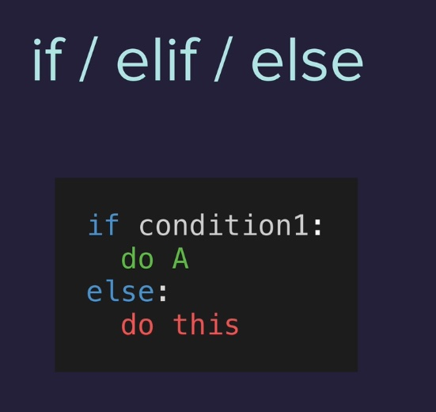
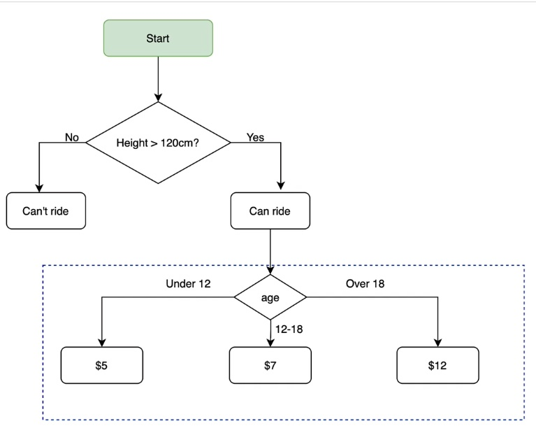
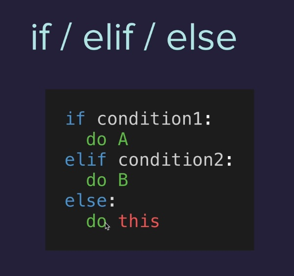

# 003-treasure-island

_table of contents_
- [Comparison Operators](#comparisonoperators)
- [Modulo Operation](#modulo)
- [Nested if and elif statements](#nestedifelif)


---

#### [Comparison Operators]()


*one equal sign is assigning*

*two equal signs is check equality*



```
if height > 120:
  print("You can ride the rollercoaster!")
else:
  print("Sorry, you have to grow taller before you can ride.")
```
  > Sorry, you have to grow taller before you can ride.

```
if height >= 120:
  print("You can ride the rollercoaster!")
else:
  print("Sorry, you have to grow taller before you can ride.")
```
  >You can ride the rollercoaster!


```
if height == 120:
  print("You can ride the rollercoaster!")
else:
  print("Sorry, you have to grow taller before you can ride.")
```
  >You can ride the rollercoaster!

```
if height != 120:
  print("You can ride the rollercoaster!")
else:
  print("Sorry, you have to grow taller before you can ride.")
```
  >Sorry, you have to grow taller before you can ride.

  ----

  #### [Modulo Operation](modulo)
  #### %

  e.g. 7 % 2
  > 1
  * 2 + 2 + 2 + 1

----

#### [Nested if and elif statements]()



***elif stands for else if, so "if" block of code is not true, can we check if this block of code is true***

```height = int(input("What's your height in cm? "))

if height >= 120:
  print("You can ride the rollercoaster!")
  age = int(input("What's your age? "))
  if age < 12:
    print("Please pay $5.")
  elif age <= 18:
    print("Please pay $7.")
  else:
    print("Please pay $12.")
else:
  print("Sorry, you have to grow taller before you can ride.")
```

***if they're not 12, can you check if they're 18***